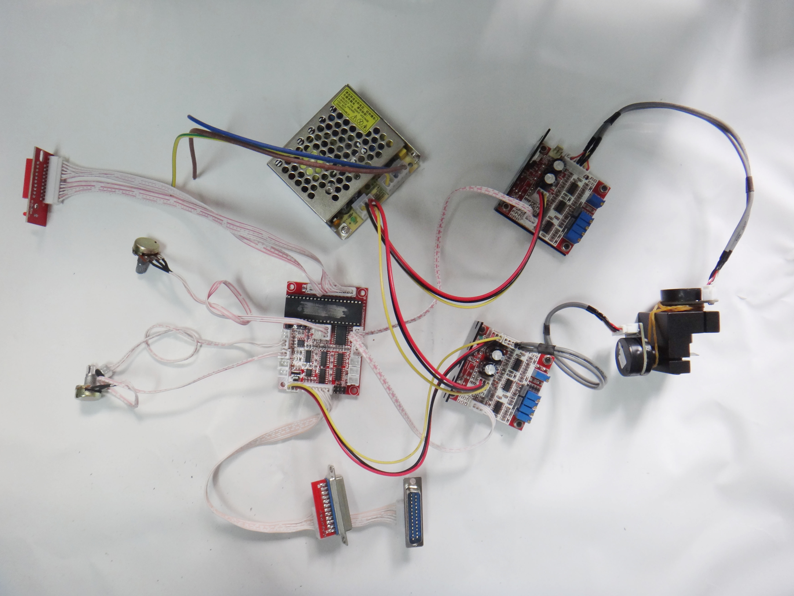

# Lasetrex

Laser projector Vectrex console

## Notes

Jonty gave me some great pointers for getting started:

> Depends what it's for. Most people I know have built their own as you can do _way_ more with them. I helped someone with a [LaserShark](http://www.macpod.net/electronics/lasershark/lasershark.php) based one about a year ago.

> Basically a LaserShark, a laser (with blanking), and two high-PPS galvo's will do you.

> But you can buy things off the shelf too.

> You'd probably want an ILDA compliant laser

> And pps (points-per-second) is the measure of how fast the galvos are, and thus how complex the vector patterns it can sustain are too

> You can build a decent one for ~£250

> Oh, and you want blanking because otherwise you'll just draw a continuous line instead of separate shapes. You tend to damage the laser by switching it really fast, so an LCD shutter is in the beamline instead.

> Oscilloscope: "Rigol DS1024 if you want large and fancy, DSO Nano if you want pocket sized and less fancy."

> "Mount it all on a bit of aluminium plate and jobs a goodun"

> "Laser projectors are pretty easy to build though, high-ppi galvos from eBay, laser with blanking from aliexpress (or eBay), lasershark board."

[GitHub - jhawthorn/vecx: vecx vectrex emulator - sdl port](https://github.com/jhawthorn/vecx)

‘Lasers capable of TTL or 0-5v analog modulation’

